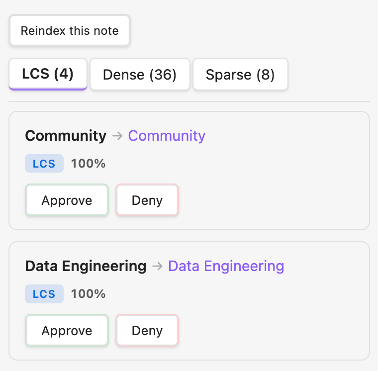
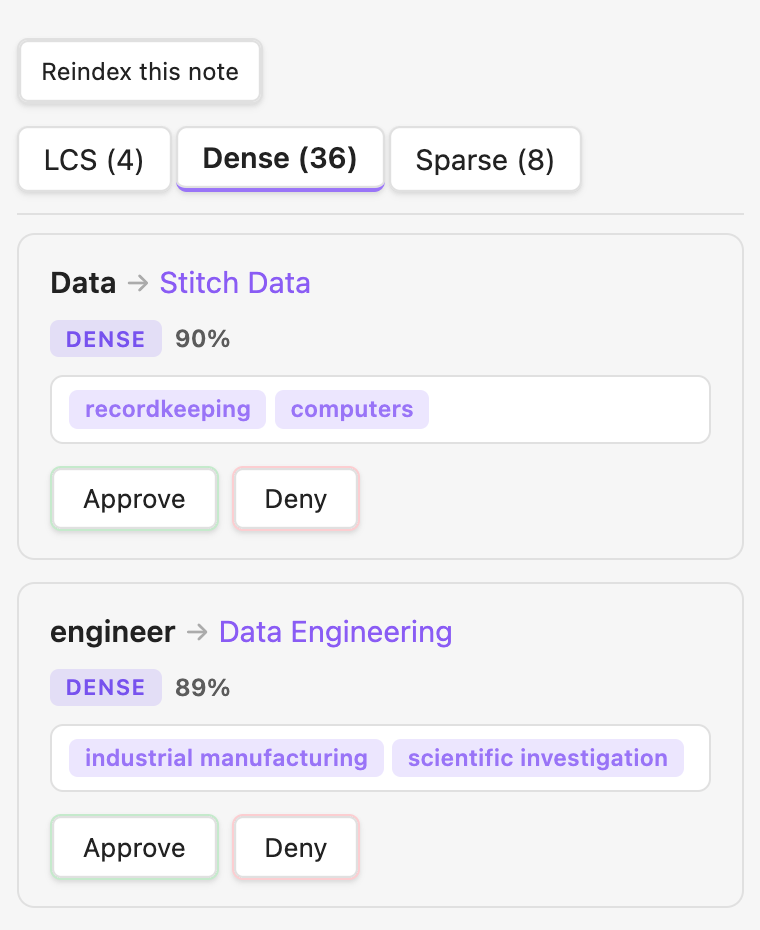
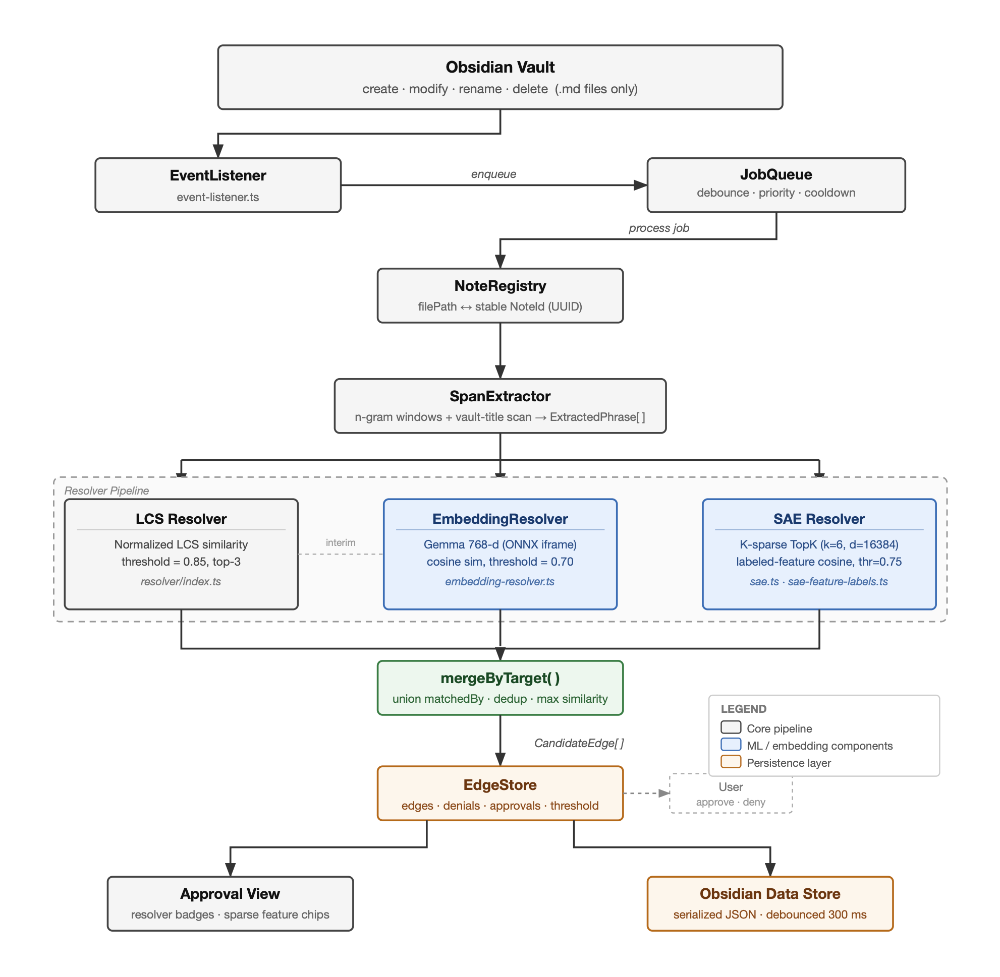
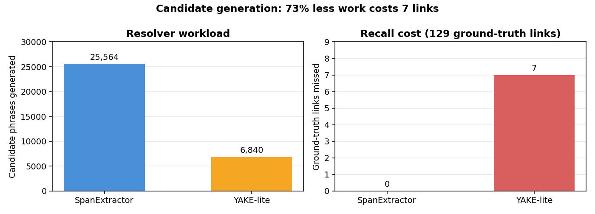
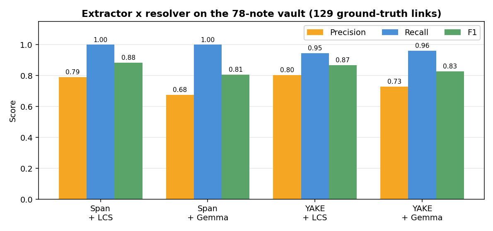
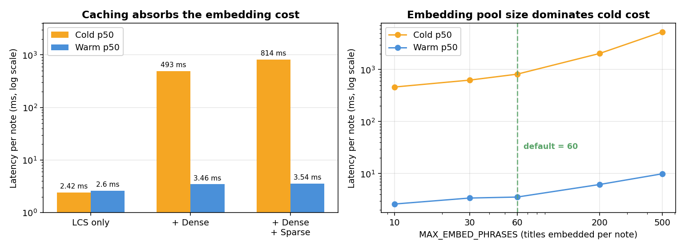
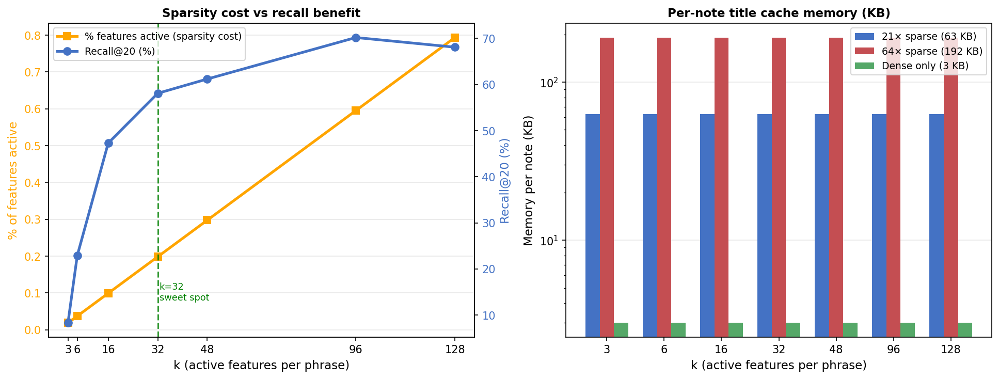
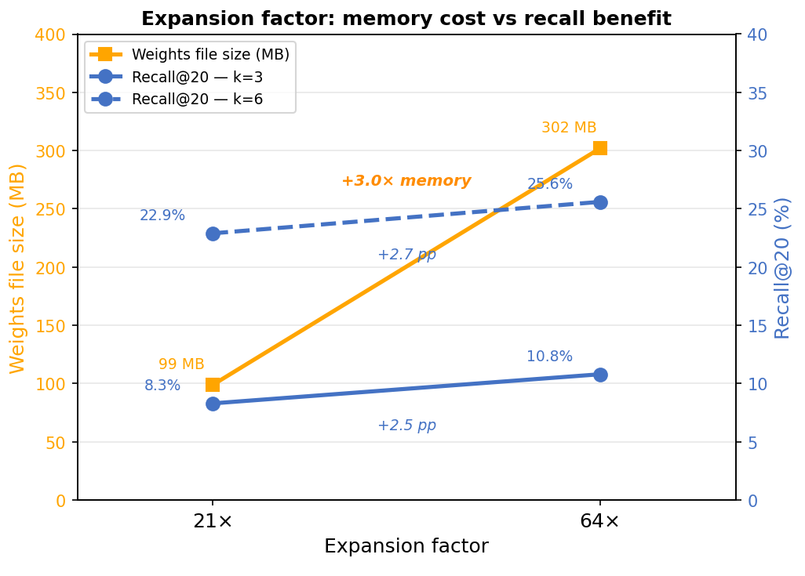
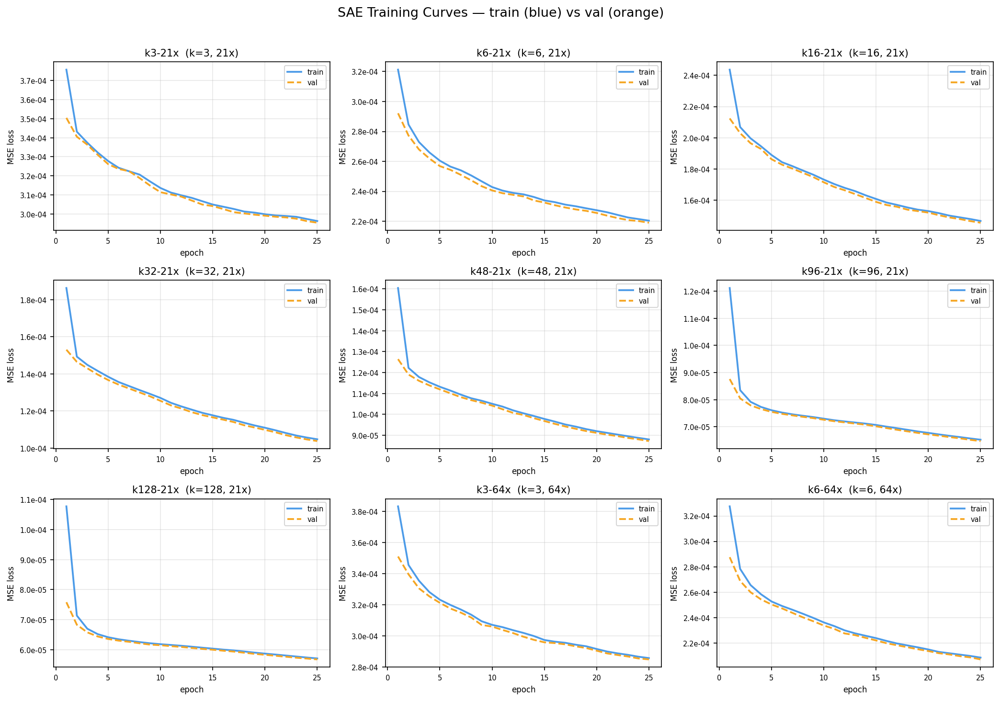
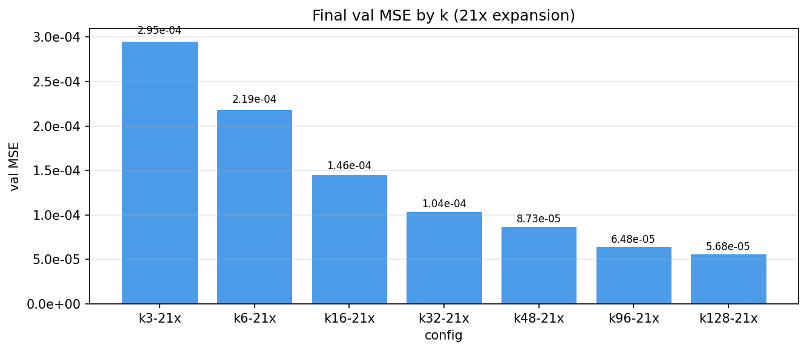

# Nexus

**Local-first automatic link discovery for Obsidian.**

Obsidian turns a folder of Markdown files into a graph: you write `[[wikilinks]]` from a phrase in one
note to the title of another. The graph is what makes the vault useful, and maintaining it by hand is
what makes the vault decay. Every time you write "data warehouse" you have to remember that a note
called *Data Warehouse* exists.

Nexus watches your vault, extracts candidate phrases from notes as you edit them, matches those
phrases against your existing note titles, and queues the results for one-keystroke approval. Nothing
about your notes leaves your machine — no API keys, no cloud vector database, no remote LLM.

<p align="center">
  
  
</p>

Suggestions are grouped by the resolver that found them. Exact and near-exact string matches (left)
are cheap and unambiguous. Semantic matches (right) catch phrases that mean the same thing without
looking the same — and each one carries human-readable concept labels explaining *why* the model
thinks they are related, so you are not approving an opaque similarity score.

This is the implementation behind a [Yale senior thesis](#thesis) on local-first link discovery.

---

## Installation

Nexus is not yet in the Obsidian community plugin directory, so install it from source. The SAE
weights are stored in Git LFS, so you need [git-lfs](https://git-lfs.com) before cloning.

```bash
git clone https://github.com/tonywanglab/nexus.git
cd nexus
npm install
cp .env.example .env       # then set VAULT_PATH to your vault's root
npm run dev                # builds and hot-deploys into $VAULT_PATH/.obsidian/plugins/nexus/
```

Reload Obsidian (`Cmd+R`) or install the [Hot Reload](https://github.com/pjeby/hot-reload) plugin to
pick up rebuilds automatically. Enable **Nexus** under *Settings → Community plugins*.

The embedding model (~30 MB, quantized ONNX) downloads once from a CDN on first use and is cached by
the browser runtime afterward. The SAE weights and feature labels ship inside the plugin bundle. After
that first download, link resolution runs entirely offline.

### Using it

| Action | How |
|---|---|
| Open the approval sidebar | `Cmd+Shift+L`, or the link icon in the ribbon |
| Move between suggestions | `J` / `K` or arrow keys |
| Approve / reject | `A` / `D`, or the buttons |
| Undo the last decision | `U` |
| Jump to the note | `Enter` |
| Adjust the similarity threshold | *Nexus settings* command |
| Re-resolve everything | **Reindex all notes** in settings |

Approving a suggestion rewrites the phrase in your note as a wikilink. Rejecting it records a denial
so the same pair is never proposed again.

---

## How it works

<p align="center">
  
</p>

A vault event flows through five stages:

1. **EventListener** (`src/event-listener.ts`) subscribes to Obsidian's `create` / `modify` / `delete`
   / `rename` hooks and drops everything that is not a `.md` file.
2. **JobQueue** (`src/job-queue.ts`) debounces per file, so a burst of keystrokes collapses into one
   job. The file you are currently editing gets a shorter delay, which gives it effective priority.
3. **SpanExtractor** (`src/keyphrase/span-extractor.ts`) enumerates every contiguous token span up to
   *n* tokens long, discarding only spans ending in a stopword and single-character unigrams. A
   YAKE-style statistical extractor (`src/keyphrase/yake-lite.ts`) is also implemented and selectable;
   the [results](#1-candidate-generation-recall-first-beats-rank-first) explain why the blunt one won.
4. **Resolvers** (`src/resolver/`) each map phrases to note titles and run in parallel:
   - **LCS** — normalizes both sides (lowercase, strip diacritics and possessives, collapse
     whitespace) and scores by longest common subsequence over the longer string, with multiplicative
     boosts for exact matches and title containment. A token-based inverted index over titles means
     each phrase is only compared against titles sharing at least one token, which is what makes the
     high-recall extractor affordable.
   - **Dense** — embeds phrase and title with EmbeddingGemma-300m (768-d) and ranks by cosine
     similarity. Catches paraphrases and morphological variants that LCS cannot.
   - **Sparse** — pushes the dense embedding through a *k*-sparse autoencoder and matches on the
     resulting labeled concept features, which is what produces the explanation chips in the UI.
5. **EdgeStore** merges the three candidate sets by target, unions their provenance, keeps the best
   score, and persists approvals and denials to Obsidian's plugin data store.

### The sparse autoencoder

A 768-dimensional embedding is good at similarity and useless at explanation: no single coordinate
means anything you can put in a UI. Nexus trains a *k*-sparse autoencoder to project that embedding
into a 16,128-dimensional space (21× expansion) where a hard top-*k* keeps only the *k* largest
activations. Because so few features fire at once, individual features specialize, and a specialized
feature can be named.

Naming happens once, offline, and never at runtime. For each learned feature direction we collect the
vocabulary terms most geometrically aligned with it and ask Qwen 2.5 7B Instruct to summarize them in
one to five words. The vocabulary is 3.27 M concept strings — 582 K ConceptNet Numberbatch concepts,
1.92 M Wikipedia titles, 780 K verbalized ConceptNet triples, and 150 K WordNet glosses. Roughly 45%
of features get a usable label; the rest fire on regions too polysemantic to summarize.

The resulting label table ships with the plugin, so runtime interpretation is a matrix multiply, a
top-*k*, and a lookup — under 0.1 ms once embeddings are cached.

---

## Results

Evaluated on **Data Engineering Wiki**, a 78-note vault with 129 human-authored wikilinks. Visible
wikilinks were stripped from the source text before each run, so the pipeline had to recover them from
prose alone. The links a human actually wrote are the ground truth.

### 1. Candidate generation: recall-first beats rank-first



Keyword extraction and link discovery look like the same problem but are not. YAKE ranks phrases by
how *salient* they are in a document; link discovery needs every phrase that might be a note title,
salient or not. YAKE-lite cuts the resolver's workload by 73%, and pays for it by dropping seven
ground-truth links — including some exact string matches — before the resolver ever sees them. A
recall error at this stage is unrecoverable downstream, so the blunt span enumerator wins.

### 2. Adding embeddings costs precision, not recall



Both `Span` configurations recover **100% of ground-truth links**. Swapping LCS for the dense
embedding resolver nearly doubles false positives (34 → 62) and drops F1, but the recall floor holds.

The false positives are worth a closer look. *Testing Your Data Pipeline* draws suggestions for "data
pipeline", "python", "sql", and "data warehouse" — genuinely related concepts that simply have no
corresponding note in this vault. Because ground truth is "links a human already wrote", a plausible
new connection is scored as an error. The precision column understates the dense resolver, and the
approval UI is the real filter.

### 3. Latency: the cold pass pays for everything



Warm p50 for the full `Span + LCS + Dense + Sparse` pipeline is **3.54 ms** per note, comfortably
inside an interactive editor. The first pass on a note costs 814 ms, almost entirely title embedding;
once cached, the sparse layer is effectively free (+0.08 ms over dense alone).

`MAX_EMBED_PHRASES`, the cap on titles embedded per note, is the dominant knob — raising it from 60 to
500 pushes the cold pass from 814 ms to 5.3 s. The span extractor's n-gram size barely registers by
comparison (+7% from n=1 to n=5). Pure LCS runs in 2.42 ms with no cold/warm distinction at all, which
makes it the right choice if you only want exact matches.

### 4. Choosing *k* and the expansion factor



The SAE is also measured on its own terms. **Recall@20** asks how much of the dense model's
nearest-neighbor ranking survives sparse encoding — the dense top-20 is the oracle, and recall is the
overlap. This isolates the autoencoder from every other pipeline stage.

Recall@20 climbs steeply through low *k*, then flattens, peaking near 70% at *k*=96 and slipping to 68%
at *k*=128. Activation density grows linearly the whole way. **k=32** sits at the elbow, where the gap
between benefit and cost is widest.



Widening the hidden layer from 21× to 64× triples the weights file (99 MB → 302 MB) and returns
+2.5–2.7 pp of Recall@20. For a plugin that ships its weights, that is not a trade worth making.

**Nexus deploys k=32 at 21× expansion.**

<details>
<summary>SAE training curves across all nine configurations</summary>



Batch size 256, learning rate 3e-4, 25 epochs on an NVIDIA L4. The pre-bias is initialized from the
corpus mean embedding and decoder columns are renormalized every 100 steps to prevent collapse.
Validation MSE falls monotonically in *k*, improving 5.2× from k=3 (2.95e-4) to k=128 (5.68e-5), with
**zero dead features** in every configuration — every learned direction received gradient signal.



Note that reconstruction quality and retrieval quality diverge: MSE keeps improving past k=96 while
Recall@20 turns over. Lower reconstruction error is not the objective we care about.

</details>

---

## Development

```bash
npm run dev            # esbuild watch → hot-deploys to $VAULT_PATH
npm run build          # type-check + production bundle
npm test               # full Jest suite
npm test -- --testPathPattern=job-queue    # one file
```

Tests live in `src/__tests__/`. The Obsidian API is mocked in `src/__tests__/__mocks__/obsidian.ts`
and mapped in via `jest.config.js`. Job queue tests use `jest.useFakeTimers()` so debounce behavior is
deterministic.

### Reproducing the evaluation

```bash
npm run eval:span-lcs        # extractor x resolver sweep (precision/recall/F1)
npm run eval:span-gemma
npm run bench:runtime:full   # latency sweep → assets/benchmark-runtime.md
python3 scripts/plot_readme_figures.py    # regenerate the figures above
```

### Retraining the SAE

Training and feature labeling run on [Modal](https://modal.com); everything else is local.

```bash
npm run vocab:build          # assemble the 3.27M-term concept vocabulary
npm run vocab:embed          # embed it with EmbeddingGemma-300m
npm run train:sae-modal      # k-sparse autoencoder (L4 GPU)
npm run label:autointerp     # name features with Qwen 2.5 7B via vLLM
```

### Layout

```
src/
  event-listener.ts     vault hooks → normalized events
  job-queue.ts          per-file debounce + active-file priority
  note-registry.ts      filePath ↔ stable NoteId
  edge-store.ts         candidate edges, approvals, denials, persistence
  keyphrase/
    preprocessing.ts    strips Markdown, preserves character offsets
    span-extractor.ts   high-recall n-gram enumeration
    yake-lite.ts        YAKE-style statistical ranking
  resolver/
    lcs.ts              normalized longest-common-subsequence similarity
    index.ts            deterministic resolver + inverted title index
    gemma-embedding.ts  EmbeddingGemma-300m via ONNX
    sae.ts              k-sparse encoder
    sae-feature-labels.ts   feature index → concept label
    merge-by-target.ts  union the three resolvers' output
  ui/
    approval-view.ts    sidebar with per-resolver tabs and feature chips
    wikilink-insert.ts  rewrites the approved phrase in place
assets/
  sae-weights-v2.bin        16,128 x 768 encoder/decoder, Git LFS (99 MB)
  sae-feature-labels-v2.json    autointerp labels, shipped in the bundle
  plots/                    SAE sweep figures
scripts/                    corpus building, training, evaluation, benchmarks
```

### Key types (`src/types.ts`)

```ts
ExtractedPhrase   { phrase, score, startOffset, endOffset, spanId }
CandidateEdge     { sourcePath, targetPath, phrase, similarity,
                    matchedBy: ("lcs" | "dense" | "sparse")[], sparseFeatures? }
QueueJob          { filePath, type, priority, enqueuedAt }
```

---

## Limitations

- **Ground truth is a lower bound.** Every metric here treats "a human already linked this" as
  correct and everything else as wrong, which systematically penalizes the dense resolver for
  proposing useful connections that did not exist yet.
- **Feature labels top out around 45% coverage.** The ceiling is invariant to *k*, expansion factor,
  and corpus size, so it belongs to the autointerp pipeline rather than the SAE. Unlabeled features
  still contribute to matching; they just cannot explain themselves.
- **The SAE is trained on short strings only** — concept names and titles, matching the runtime input
  distribution. Features may not capture how concepts appear in running prose.
- **The labeling vocabulary is fixed and generic.** Grounding it in the user's own note titles would
  likely produce labels that read as more relevant in context.
- **The LCS threshold is a blunt instrument.** The default of 0.85 favors precision; lowering it
  surfaces "data warehouses" → *Data Warehouse* but also pulls in "data lake". The exact-match boost
  (×1.5, clamped) compresses the top of the ranking, so ordering among several strong matches for a
  short phrase like "data" is effectively arbitrary.

## References

- Campos et al., ["YAKE! Keyword Extraction from Single Documents Using Multiple Local Features"](https://doi.org/10.1016/j.ins.2019.09.013), *Information Sciences* 509 (2020)
- Speer, Chin & Havasi, ["ConceptNet 5.5: An Open Multilingual Graph of General Knowledge"](https://arxiv.org/abs/1612.03975), AAAI 2017
- Makhzani & Frey, ["k-Sparse Autoencoders"](https://arxiv.org/abs/1312.5663), 2013
- Bricken et al., ["Towards Monosemanticity: Decomposing Language Models with Dictionary Learning"](https://transformer-circuits.pub/2023/monosemantic-features), Transformer Circuits Thread, 2023
- Miller, "WordNet: A Lexical Database for English", *CACM* 38.11 (1995)

## License

MIT
